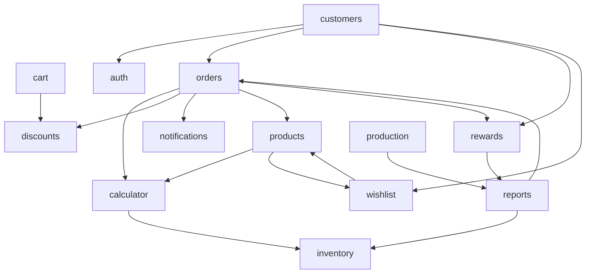

# Documento 2 — Mapa de arquitectura y dependencias

**Proyecto:** Hefesto 3D · **Fecha:** 2026-07-06 · **Doc 2 de 15.**

## Modelo de capas (Cap. 5 y 19)

Las dependencias van **solo hacia abajo**:

```
UI (components, app/*)        ← nunca importa repositorios
  → actions.ts                (server actions: authz + Zod + orquestación)
    → services/*              (reglas de negocio puras + orquestación)
      → repository.ts/queries (ÚNICA puerta a la DB)
        → core/db (Drizzle)
```

Reglas duras (Cap. 19):

1. La UI **nunca** importa repositorios.
2. Un feature **no** importa el repository de **otro** feature.
3. Sin ciclos: las dependencias entre features van hacia abajo.

## Grafo de dependencias entre features

Adyacencia observada (feature → features que importa):

| Feature    | Importa a                                                   |
| ---------- | ----------------------------------------------------------- |
| calculator | **inventory**                                               |
| cart       | discounts                                                   |
| customers  | auth, orders, rewards, wishlist                             |
| orders     | calculator, **discounts**, notifications, products, rewards |
| production | reports                                                     |
| products   | calculator, **wishlist**                                    |
| reports    | inventory, orders                                           |
| rewards    | reports                                                     |
| wishlist   | **products**                                                |



## Violaciones de reglas de dependencia

### 🔴 R2 — Feature importa el data-layer de OTRO feature (real)

Estas importaciones saltan el service del otro feature y tocan su capa de datos
directamente (`queries.ts` / `repository.ts` son data-layer):

| Origen                            | Importa                                              | Archivo:línea |
| --------------------------------- | ---------------------------------------------------- | ------------- |
| `calculator/actions.ts`           | `@/features/inventory/queries` (`listFilamentsView`) | :7            |
| `calculator/service.ts`           | `@/features/inventory/queries`                       | :3            |
| `reports/service.ts`              | `@/features/inventory/queries`                       | :2            |
| `orders/services/orderService.ts` | `@/features/discounts/repository` (import dinámico)  | :38           |

**Lectura:** el patrón repetido es que `inventory` expone `queries.ts` como
si fuera una API pública y otros features la consumen. No rompe capas _dentro_
del feature, pero sí la regla "no importar el repo de otro feature". Recomendado:
exponer una función de servicio en `inventory` (p. ej. `inventory.listFilamentsForCalc()`)
y que calculator/reports la consuman; o mover esa lectura a `core` si es
verdaderamente transversal. El import dinámico de `discounts/repository` en
`orderService` es el mismo caso disfrazado de lazy import.

### 🟡 R1 — UI importa del repository (solo tipos, NO es violación de runtime)

| Componente                                       | Importa                                               |
| ------------------------------------------------ | ----------------------------------------------------- |
| `calculator/components/price-calculator.tsx`     | `import type { CalcHistoryRow } from "../repository"` |
| `notifications/components/notification-bell.tsx` | `import type { Notification } from "../repository"`   |
| `production/components/production-board.tsx`     | `import type { JobRow, ... } from "../repository"`    |

Son **`import type`**: se borran en compilación, no hay acoplamiento en runtime
ni el cliente arrastra código de DB. **No es violación funcional.** Recomendación
cosmética: reexportar esos tipos desde `types.ts` para que la UI no nombre al
repository.

### 🟠 Ciclos entre features (smell arquitectónico)

- **`products ↔ wishlist`**: `products` importa `wishlist` y `wishlist` importa
  `products`. Ciclo de 2 nodos.
- **`orders → rewards → reports → orders`**: ciclo de 3 nodos (orders otorga
  puntos vía rewards; rewards lee reports; reports lee orders).

Los ciclos no rompen el build (Next/TS los toleran) pero dificultan el testeo
aislado y el razonamiento. Sugerido: extraer las piezas compartidas (p. ej.
tipos de pedido que usa reports) a un lugar neutral, o invertir la dependencia
(que reports no dependa de orders sino de una vista de datos en core).

## Lo que SÍ está bien

- **Dentro de cada feature** las capas se respetan: la UI llama actions, las
  actions llaman services, los services llaman al repository. No se detectaron
  componentes llamando a `db` directamente ni actions saltando el service para
  escribir en DB.
- `core/*` no importa de `features/*` (núcleo independiente). Correcto.
- La regla "lógica de negocio en services, no en componentes" se cumple: los
  cálculos de dinero/stock viven en módulos puros (`calculator.ts`,
  `economics.ts`, `points.ts`, `discounts/service.ts`, `inventory/service.ts`).

## Resumen

| Chequeo                                | Resultado                                                      |
| -------------------------------------- | -------------------------------------------------------------- |
| UI → repository (runtime)              | ✅ Sin violaciones (solo `import type`)                        |
| Feature → repo/queries de otro feature | 🔴 4 casos (inventory×3, discounts×1)                          |
| Capas dentro del feature               | ✅ Correctas                                                   |
| core independiente de features         | ✅                                                             |
| Ciclos entre features                  | 🟠 2 ciclos (products↔wishlist; orders→rewards→reports→orders) |

_Fin del Documento 2._
